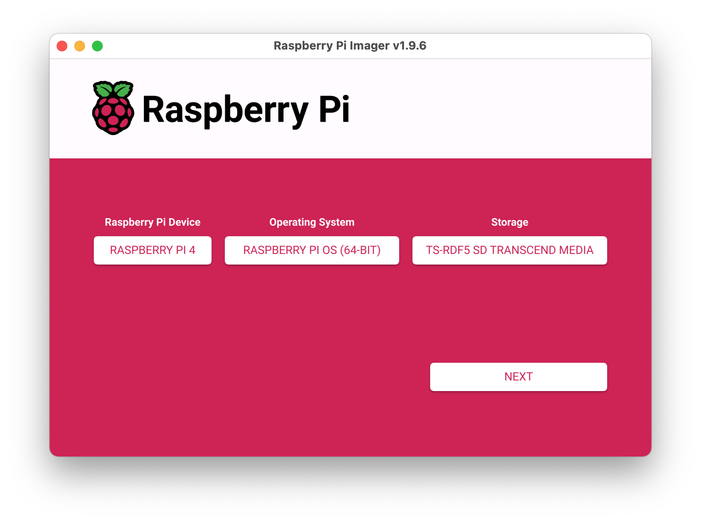
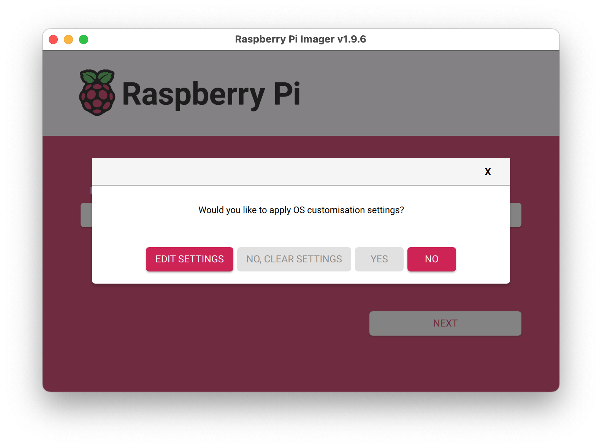
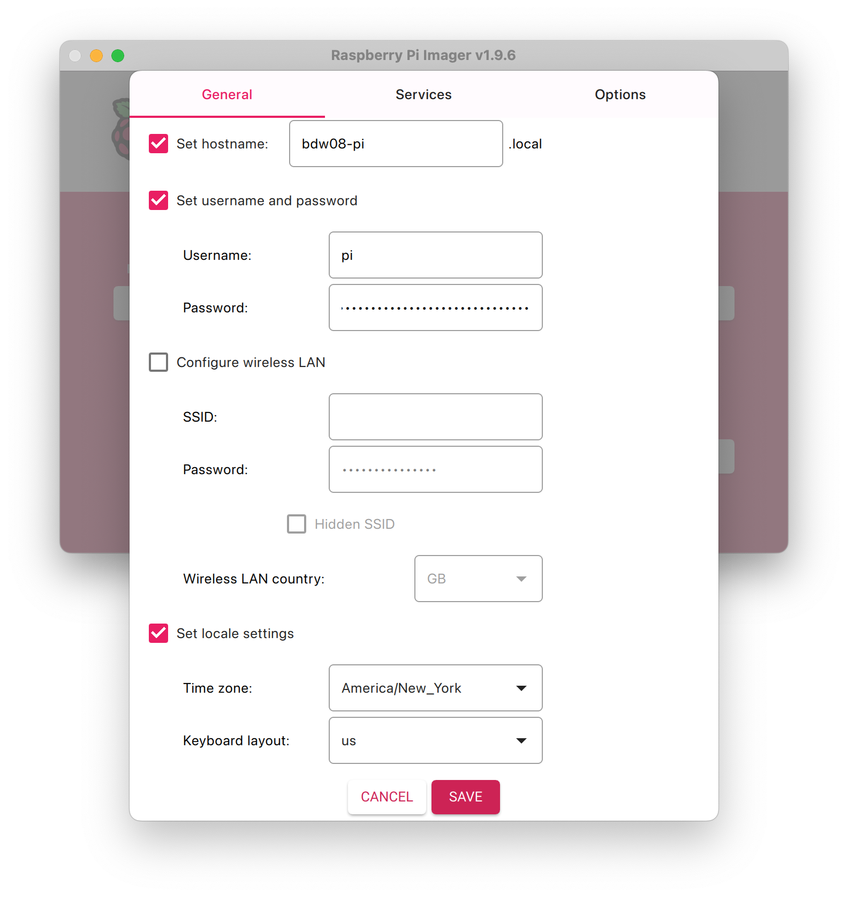
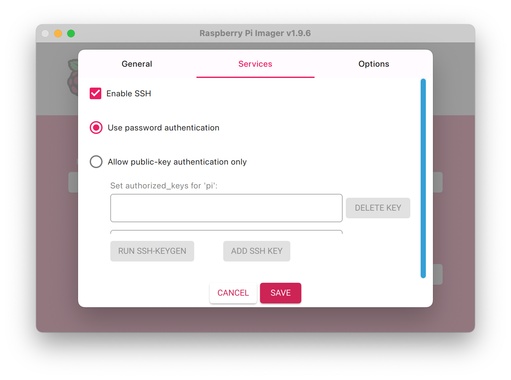
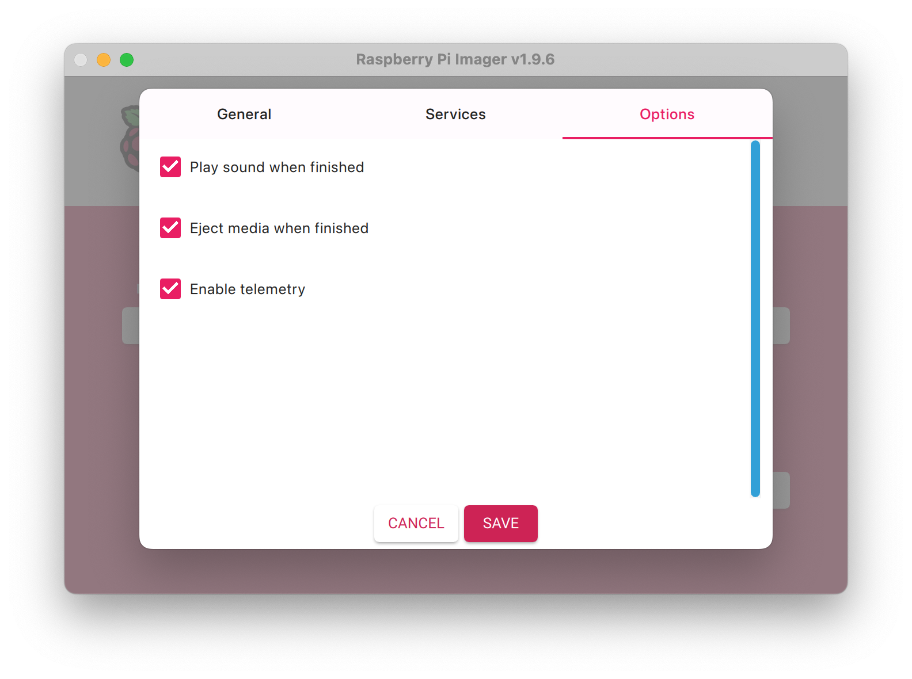

> You will be using a Raspberry Pi (a small “single board computer”) to host your websites this semester. Raspberry Pi has its own OS that will need to be installed via SD card.

## 1. Install and open the Raspberry Pi Imager.
The application is available for download at [raspberrypi.com](https://www.raspberrypi.com/software/)

## 2. Select the device, operating system, and storage options.
- Device: Raspberry Pi 4
- Operating System: Raspberry Pi OS (64-Bit)
- Storage: [your-sd-card]



## 3. Edit and apply the OS customization settings.
- Hostname: [your-net-id]-pi
- Username: pi
- Password: raspberry
- SSH: Enabled ("use password authentication")

 




## 4. Plug your Raspberry Pi in.
Remove the SD card from your computer and plug it into the raspberry pi. Then, plug your Pi into a monitor/keyboard.

## 1. Connect to the YaleSecure Wifi
Use the following settings:

```
WiFi Security: WPA & WPA2 Enterprise
Authentication: Protected EAP
Anonymous Identity: [leave blank]
Domain: yale.edu
CA Certificate: (none)
Certificate Password: [leave blank]
☑️ No CA certificate is required
PEAP version: Automatic
Inner authentication: MSCHAPv2
Username: [your-net-id]
Password: [your-password]
```

## 3. Get the computer's IP address
open the terminal program type the following command in the Raspberry Pi's terminal, then hit enter.

```
ifconfig
```


## 2. Install the server software.
While connected via SSH, type the following command, then hit enter.

```
sudo apt-get install apache2 -y && sudo chown -R $USER:www-data /var/www
```


## 4. Confirm that the server is working.
Visit your IP address using firefox/chrome/safari.

