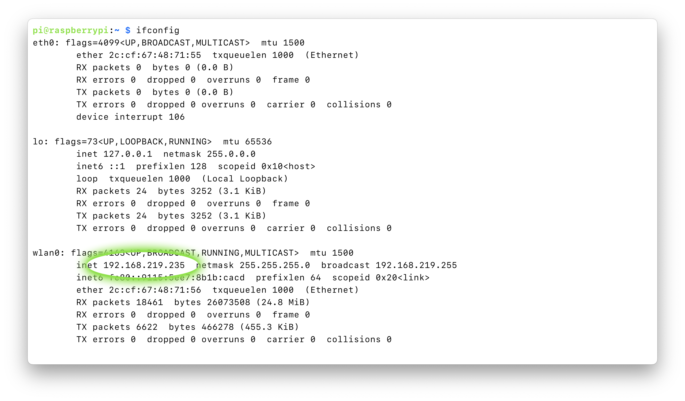
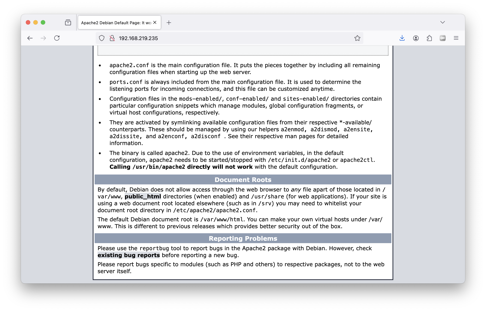

## 1. Connect to the YaleSecure Wifi
Use the following settings:

```
WiFi Security: WPA & WPA2 Enterprise
Authentication: Protected EAP
Anonymous Identity: [leave blank]
Domain: yale.edu
CA Certificate: (none)
Certificate Password: [leave blank]
☑️ No CA certificate is required
PEAP version: Automatic
Inner authentication: MSCHAPv2
Username: [your-net-id]
Password: [your-password]
```


## 3. Get the computer's IP address
open the terminal program type the following command in the Raspberry Pi's terminal, then hit enter.

```
ifconfig
```




## 2. Install the server software.
While connected via SSH, type the following command, then hit enter.

```
sudo apt-get install apache2 -y && sudo chown -R $USER:www-data /var/www
```


## 4. Confirm that the server is working.
Visit your IP address using firefox/chrome/safari.

