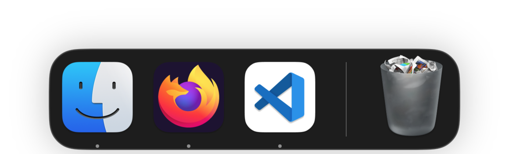
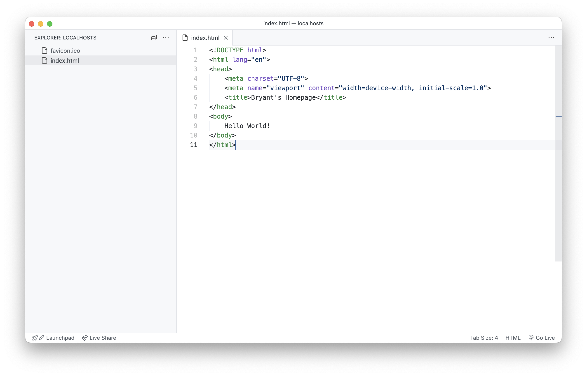

### 1. Make a site folder
Navigate to the `📂~/sites` folder on your computer (if you don't have one already, make one!) and create a subfolder named `📂localhosts`. 

### 2. Open VS Code
You can open your recently created folder in VSCode by dragging it onto the VS Code icon in Mac OS dock:

### 3. Create an Index file and Favicon
Right click the sidebar in the left of the window to create a new file. Name it `📄index.html`. Create a basic HTML file and add a message, like "Hello, World!". This will be your website's homepage:

~~~
<!DOCTYPE html>
<html lang="en">
<head>
	<meta charset="UTF-8">
	<meta name="viewport" content="width=device-width, initial-scale=1.0">
	<title>Bryant's Homepage</title>
</head>
<body>
	Hello, World!
</body>
</html>
~~~

Next, make a favicon and add drag in into the sidebar. This will copy your favicon into your site's directory. When you're done, your workspace should look like this:

### 4. Test your Local Website
Now, test your local website by clicking the `Go Live` button on the bottom right of the VS Code window. This will create a temporary server on your computer – and should automatically open the window in your web browser:

At this point, your folder should have the following structure:
~~~
📂 localhosts/
├─ 📄 index.html 
└─ 🌸 favicon.ico 
~~~

### Next: [Uploading via SFTP](/posts/sftp-setup)
