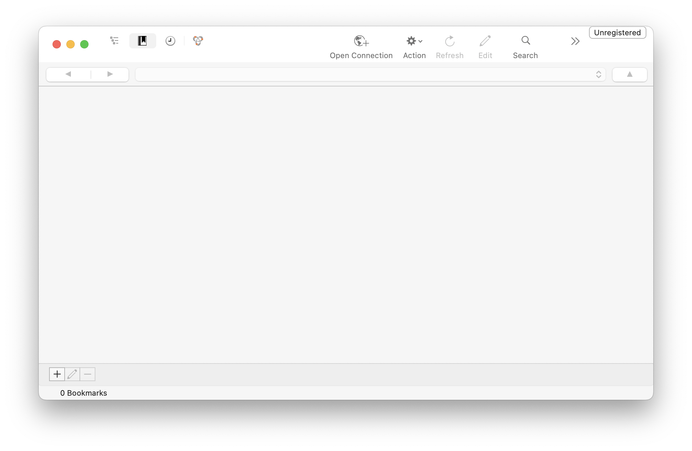
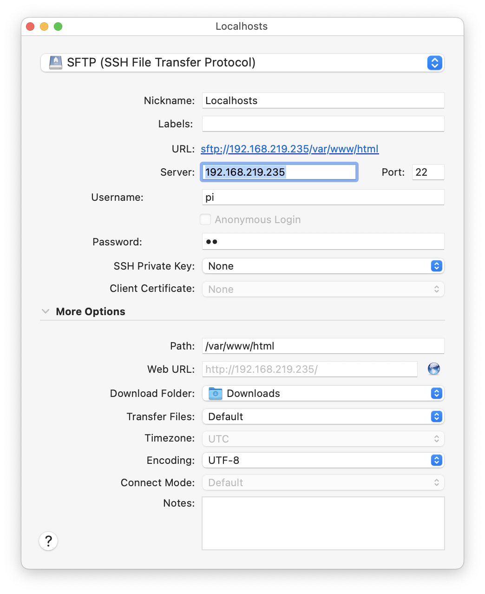
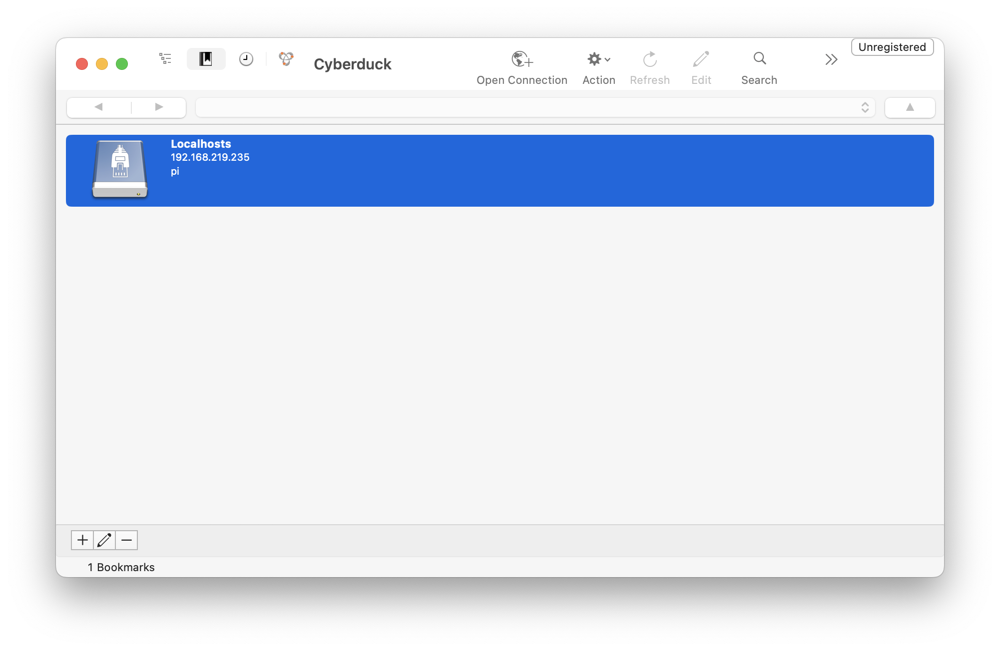
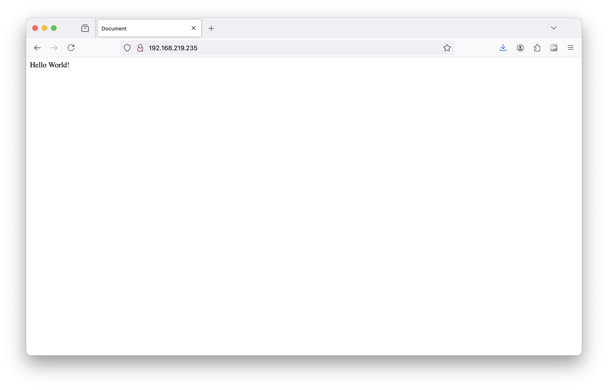

## 1. Install and open Cyberduck.
The application is available for download at [cyberduck.io](https://cyberduck.io/).

## 2. Create a new bookmark for your server.
Open the app and navigate to `bookmark > new bookmark` via the menu bar and add the following settings (use your own IP address).

## 3. Connect to the server and upload your website.
Copy the contents of your local website folder over to Cyberduck by dragging it into the `/var/www/html` folder. Visit your website using firefox/chrome/safari.

