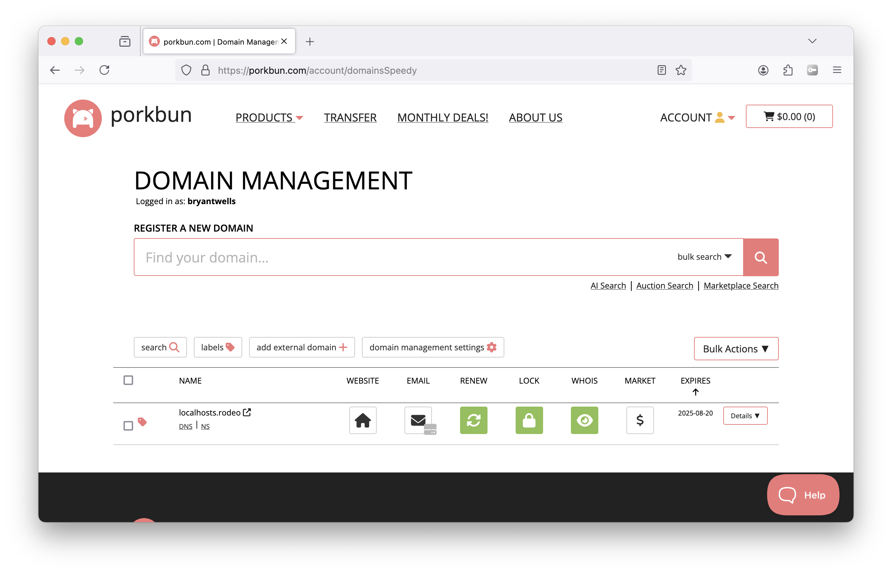
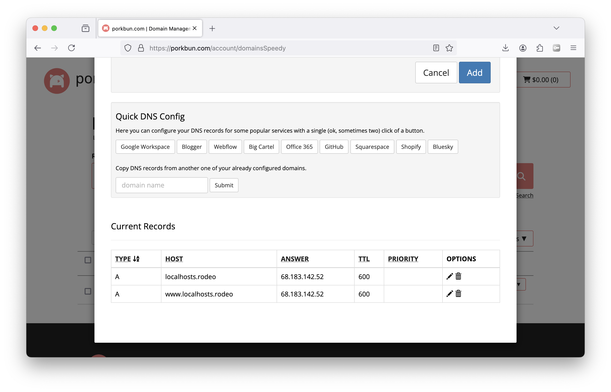
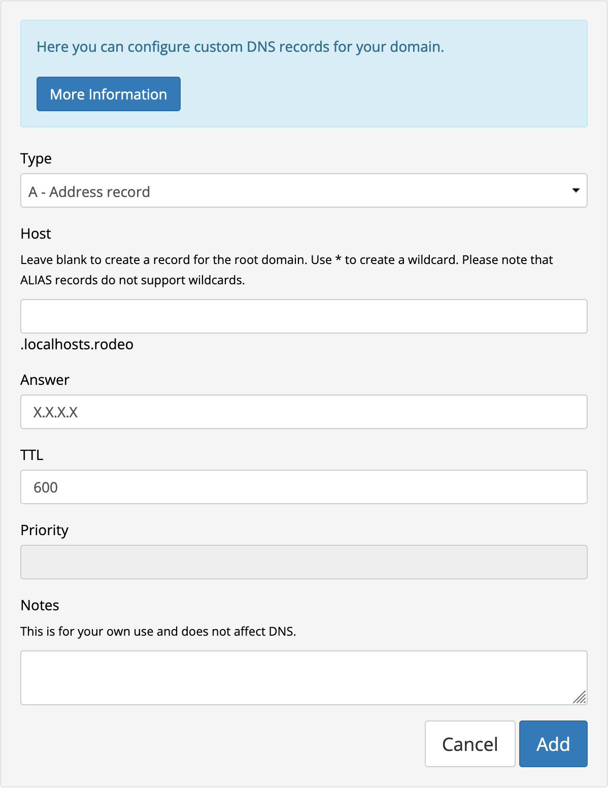

## 1. Buy a domain.
You can use any domain registrar, I recommend [Porkbun](https://porkbun.com/).

## 2. Delete any existing records.
Hover over your URL and click on the link labeled "DNS". Scroll to the bottom of the pop up and click on the trash bins to delete any existing DNS records. 

## 3. Create a new "A Record".
Create a new DNS record with the following values (use your server's IP instead of X.X.X.X)

Your domain should now point to your server's IP address! DNS changes should happen within a few minutes, but can take up to 24hrs.