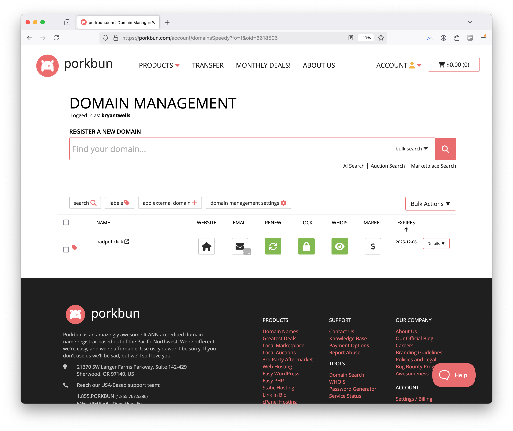

## 1. Log into Porkbun.
Find the domain you would like to add hosting to, and click the on the home icon under the 'website' column.

## 2. Select and purchase a hosting plan.
I would suggest the basic 'Shared cPanel Hosting'.

## 3. Launch cPanel.
After purchasing the cPanel plan, you'll be redirected to the cPanel homepage.

## 4. Upload your site files using the File Manager.
Place your files in the `public_html` folder. Delete or overwrite the existing `index.php` file.

## 5. Update your site's DNS Records.
If your site's 'A Record' is pointing to you Raspberry Pi, you'll need to redirect it to your new server's IP address. Navigate back to your account page, click the green "cPanel" button next to your URL, and click the "Fix DNS" button at the bottom of the page. This will reset your domain DNS settings.

Your domain should now point to your new IP address! DNS changes should happen within a few minutes, but can take up to 24hrs.