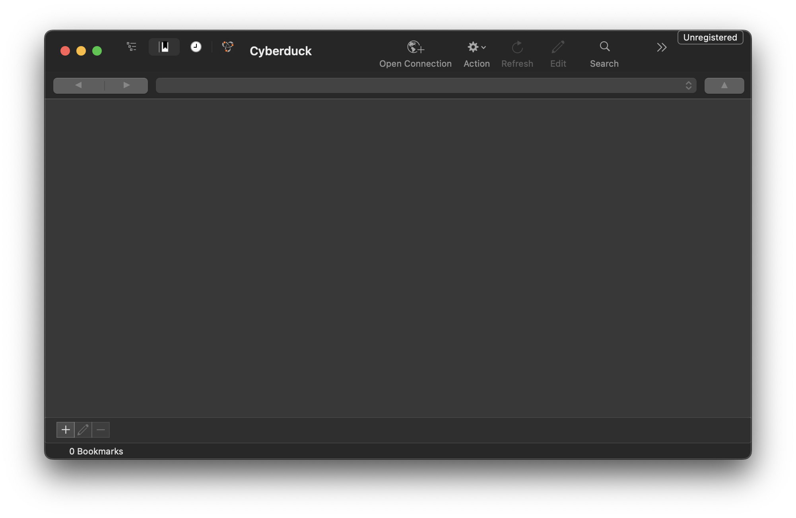
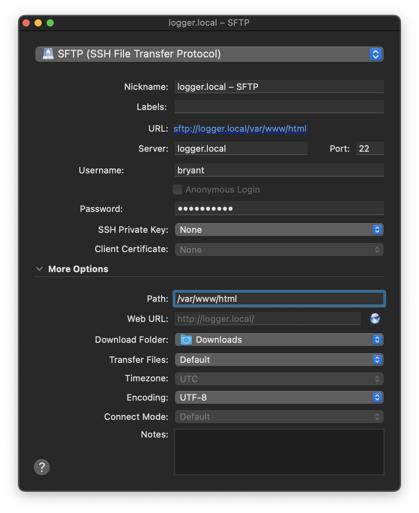
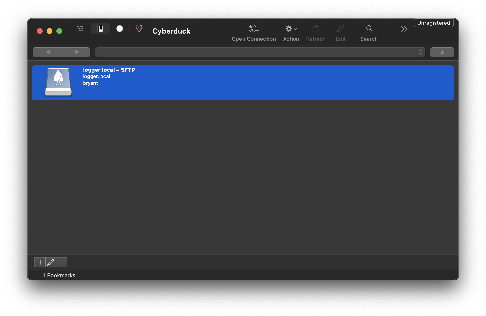
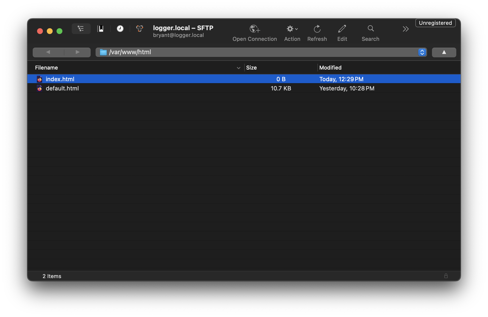
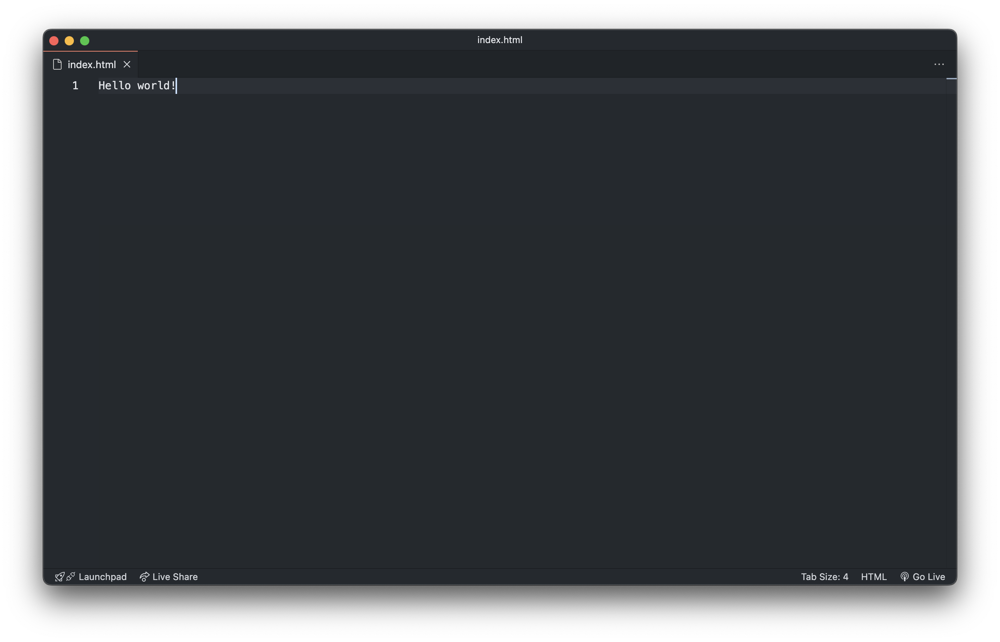
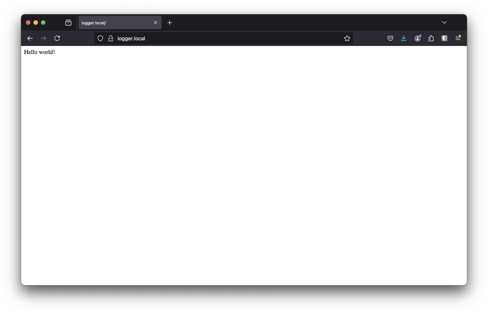

> Now that our servers are set up, we'll update our website's content using SFTP. 

## 1. Install and open Cyberduck.
The application is available for download at [cyberduck.io](https://cyberduck.io/).

## 2. Create a new bookmark for your server.
Open the app and navigate to `bookmark > new bookmark` via the menu bar. Change the settings according to your setup.

## 3. Connect to the server and make an index.html file.
Rename the existing index file to `default.html`and create a new file called `index.html`. Right-click the new `index.html` file to edit it in VS-Code (or your prefferred code editor).

## 3. View your website!
Visit `[host-name].local` using firefox/chrome/safari.

