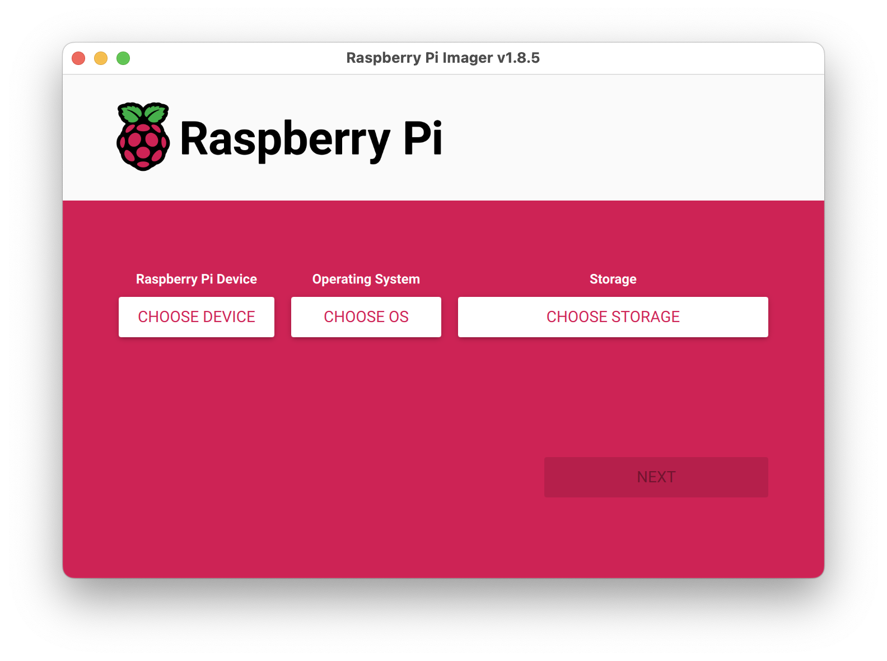
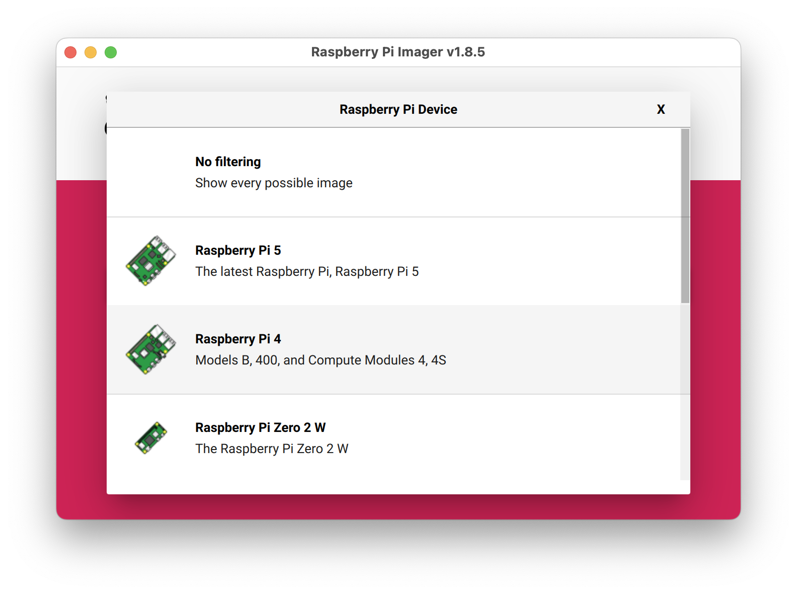
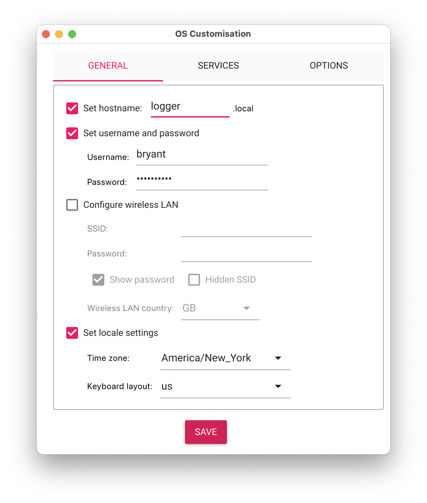
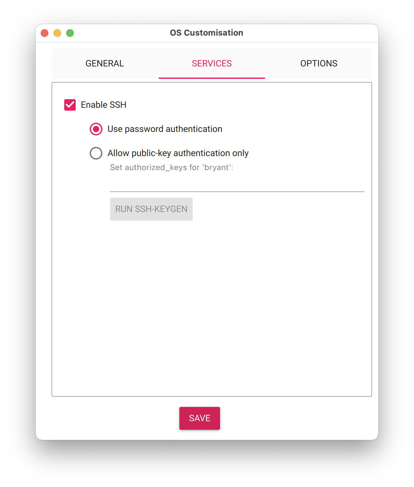
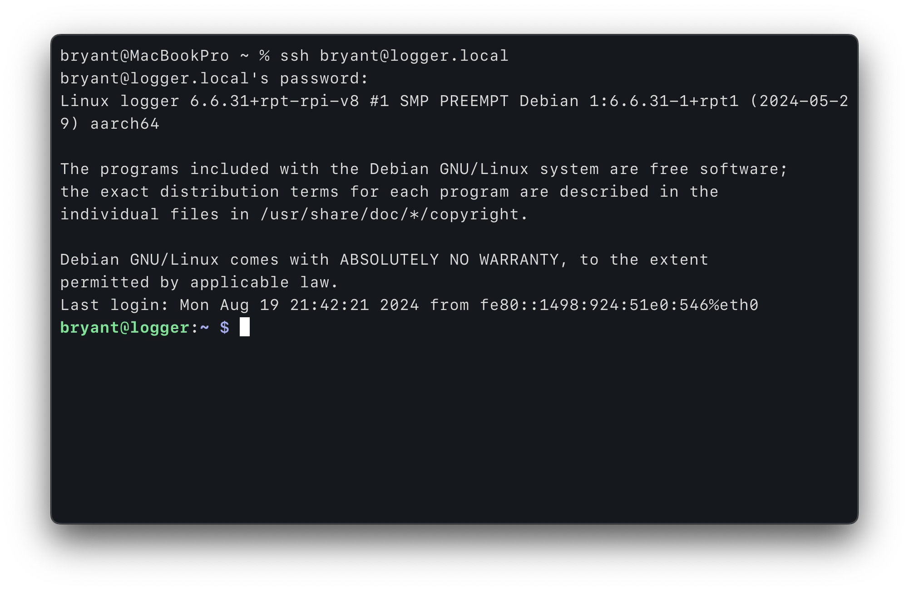
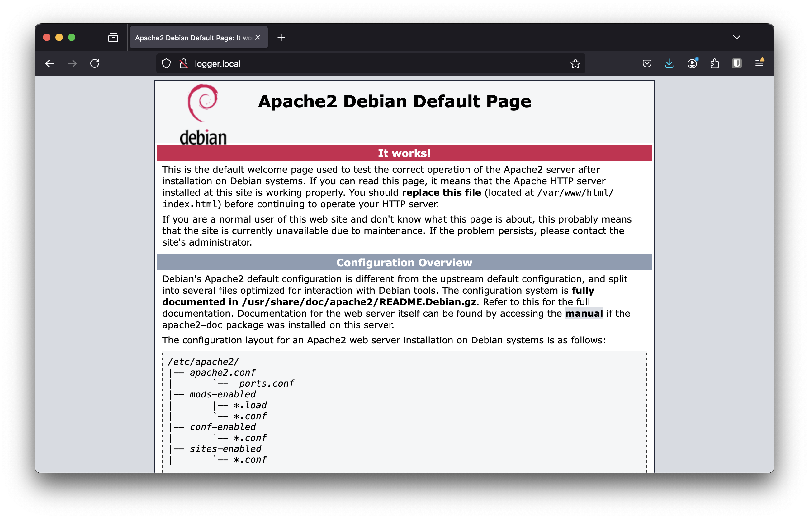

> You will be using a Raspberry Pi (a small “single board computer”) to host your websites this semester. Raspberry Pi has its own OS that will need to be installed via SD card.

## 1. Install and open the Raspberry Pi Imager.
The application is available for download at [raspberrypi.com](https://www.raspberrypi.com/software/)



## 2. Select the device, operating system, and storage options.
- Device: Raspberry Pi 4
- Operating System: Raspberry Pi OS (64-Bit)
- Storage: [your-sd-card]



## 3. Edit and apply the OS customization settings.
Make sure to set a unique hostname! This will be the URL you use to access your class website.




## 4. Plug your Raspberry Pi in.
Remove the SD card from your computer and plug it into the raspberry pi. Take a look around the studio, plug your server in an open ethernet jack (also make sure you have access to power – a red light should appear). Before moving on, give the RPi a few minutes to boot up (until the yellow light stops blinking).

## 5. Connect to your Raspberry Pi remotely.
Open Terminal and type the following command to connect remotely to your server, then hit enter. Type in your password then hit enter again.

```
ssh [user-name]@[host-name].local
```



## 6. Install the server software.
While connected via SSH, type the following command, then hit enter.

```
sudo apt-get install apache2 php -y && sudo chown -R $USER:www-data /var/www
```

## 6. Confirm that the server is working.
Visit `[host-name].local` using firefox/chrome/safari.


